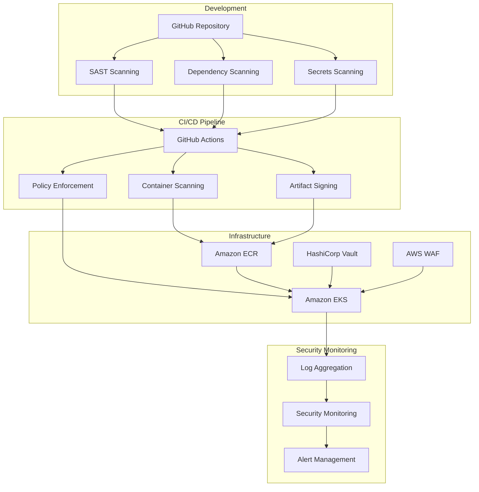

# System Architecture

## Overview
This document outlines the high-level architecture of our DevSecOps implementation, showing how different security controls and monitoring systems interact.

## Architecture Diagram

## Component Description

### Development
- **GitHub Repository**: Source code and version control
- **SAST Scanning**: Static Application Security Testing
- **Dependency Scanning**: Checks for vulnerable dependencies
- **Secrets Scanning**: Prevents secret exposure

### CI/CD Pipeline
- **GitHub Actions**: Automated pipeline orchestration
- **Policy Enforcement**: OPA/Gatekeeper policies
- **Container Scanning**: Image vulnerability scanning
- **Artifact Signing**: Ensures supply chain security

### Infrastructure
- **Amazon EKS**: Kubernetes cluster
- **Amazon ECR**: Container registry
- **AWS Secrets Manager**: Secrets management
- **AWS WAF**: Web Application Firewall

### Security Monitoring
- **Security Monitoring**: SIEM system
- **Log Aggregation**: Centralized logging
- **Alert Management**: Security alerting

## Security Controls

| Component | SOC 2 Control | Implementation |
|-----------|---------------|----------------|
| SAST | CC7.1 | Automated code scanning |
| OPA | CC7.2 | Policy enforcement |
| AWS Secrets Manager | CC6.1 | Secrets management |
| WAF | CC6.6 | Edge security |
| SIEM | CC7.2 | Security monitoring |

## Network Flow

1. Developers commit code to GitHub
2. GitHub Actions triggers security scans
3. On pass, builds container images
4. Images scanned and signed
5. Deployment to EKS if policies pass
6. Continuous security monitoring

## Security Zones

1. **Development Zone**
   - Developer workstations
   - CI/CD tools
   - Code repositories

2. **Production Zone**
   - EKS clusters
   - Database systems
   - Application services

3. **Security Zone**
   - Monitoring systems
   - Log aggregation
   - Security tools

## Update Process

This architecture document should be reviewed and updated:
- When new components are added
- After major system changes
- During security reviews
- As part of compliance audits 